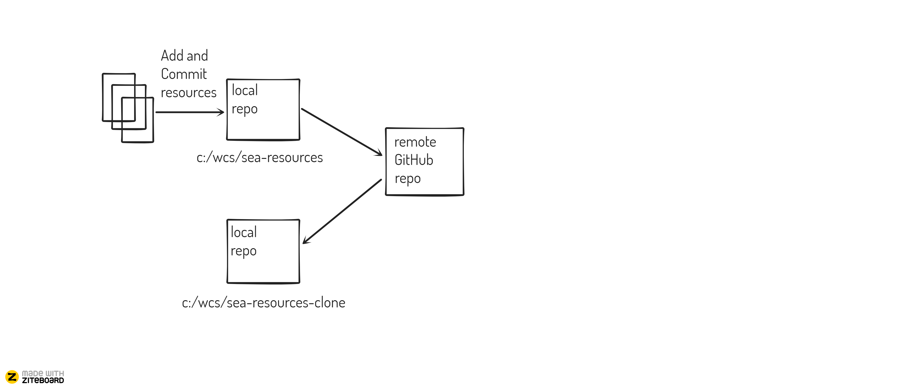

# Create a SEA Resource Repo

    As a participant of SEA, I can quickly access (and change) resources which are important for the training.

## Dojo

### Setup

* Set default branch to "main"
* `git config --global init.defaultBranch main`

Step 1: Create a local git repository 

* `git init`

Step 2: Add a new file to the repo (eg. links.md)

* create file links.md
* `git add links.md`

Step 3: Commit the new file

* `git commit -m "New file created."`

Step 4: Create a new repository on GitHub

* github.com im Browser aufrufen
* eigenes repo unter eigenem User erstellen (zb https://github.com/WildCodeSchool/)

Step 5: Set Origin on local Repo

* Copy Repo URL (REPO_URL) from GitHub (HTTPS!)
* `git remote add origin ${REPO_URL}`

Step 6: Push the changes to the GitHub Repo

* `git push origin main`

_Note_: GitHub Personal Access Token is necessary here, see file [links.md](../links/links.md)

Step 7: Clone Repo to new local Repo

* `cd ..`
* `git clone ${REPO_URL} sea-resources-clone`

Step 8: Add new links to the links.md

* `git add links.md`
* `git commit -m "Links hinzugefügt."`

Step 9: Push the changes

* `git push origin main`

Step 10: Revisit the changes in GitHub

Step 11: Get the latest changes to first local Repo

### Known Issues

Q: "main and master are entirely different commit histories."  
A: https://stackoverflow.com/questions/23344320/there-isnt-anything-to-compare-nothing-to-compare-branches-are-entirely-diffe

